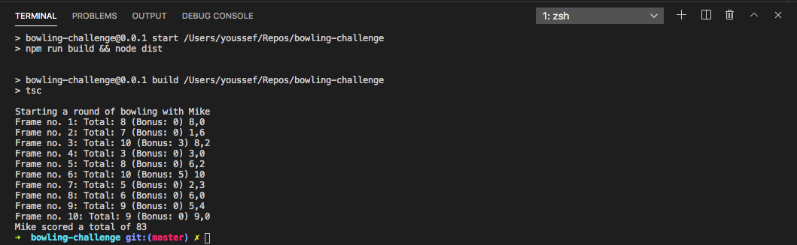

# Bowling challenge

### Build and run

Install the dependencies by running

    npm install

Run the test

    npm test

Build and start the app by running

    npm start

See console output:

**Edit** (16.10.2020): Refactored and added tests after submiting the code challenge for review.